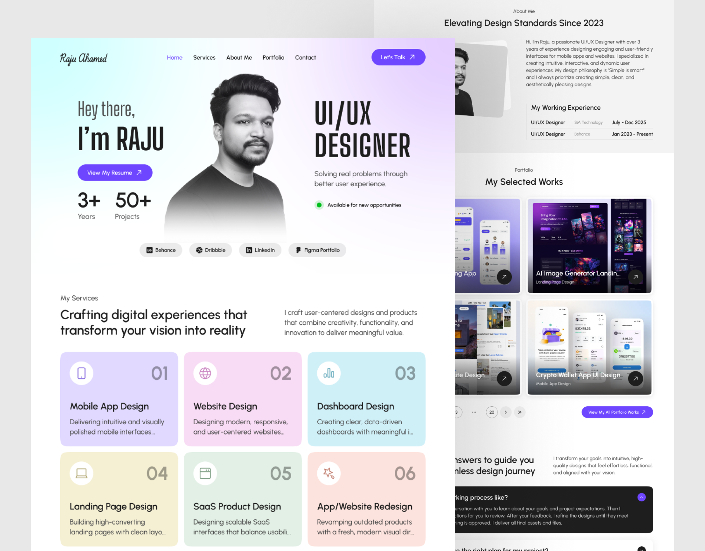

 

# 🎨 Designer Portfolio

A clean and modern portfolio website built with **Next.js 16**, **React 19**, and **TailwindCSS 4**.

---

### 🛠️ Tech Stack

---

## 🚀 About This Project

This project is a fully responsive **designer portfolio** built using the latest Next.js App Router.  
It includes all essential sections of a modern portfolio website:

- ✨ Hero
- 🛠️ Services
- 👤 About
- 📁 Projects
- ❓ FAQ
- 📞 Contact & Footer

The codebase is clean, modular, and easy to extend for future portfolio needs.

---

## 📦 Key Features

- ⚡ Modern UI with smooth layout
- 🎯 Optimized for performance
- 📱 Fully responsive
- 🎨 TailwindCSS 4 styling
- 🔗 Modular components for easy customization

---

## 👨‍💻 Author

**Jobair Al Sarkar**  
Software Engineer  
📧 jobair.a.sarkar@gmail.com

---

### ⭐ If you like this project, consider giving it a star!

